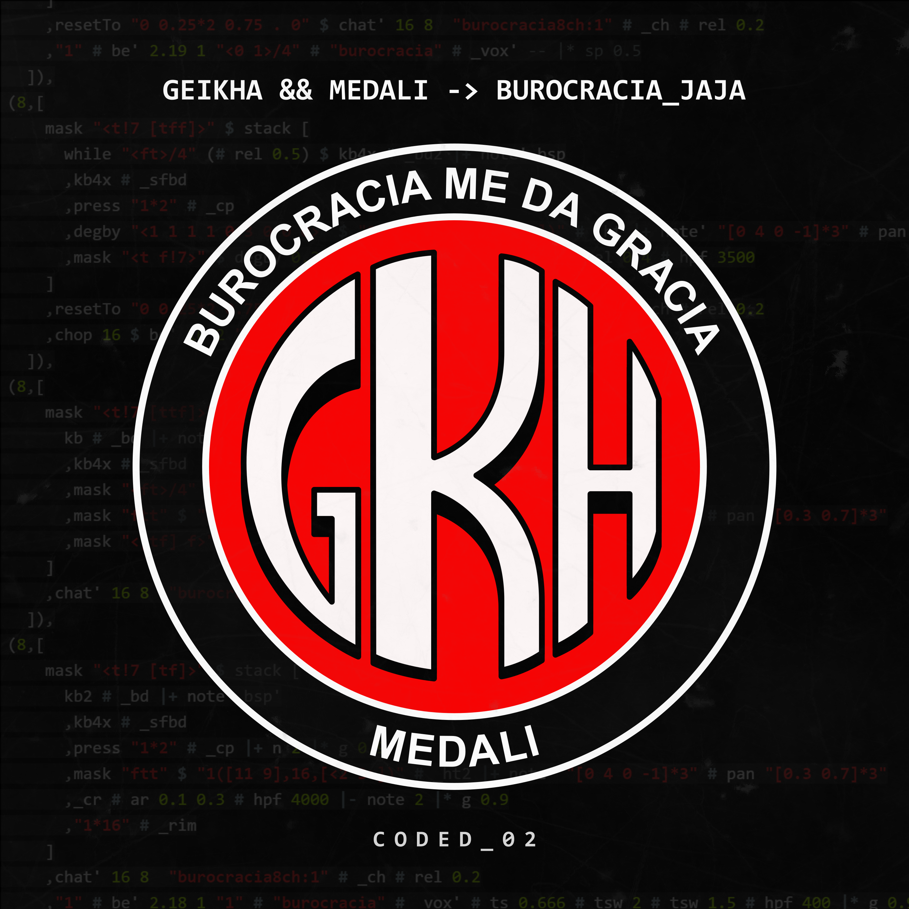

# BUROCRACIA_JAJA
Code for my single [*BUROCRACIA_JAJA*](https://geikha.bandcamp.com/album/burocracia-jaja-coded-02), which is in itself an edit of the song *30 Grados* by El Turko & Mandale Flow. Made using [TidalCycles](https://github.com/tidalcycles/Tidal) and [SuperCollider](https://github.com/supercollider/supercollider).

[](https://geikha.bandcamp.com/album/burocracia-jaja-coded-02)

## About this repo

### TidalCycles

`BUROCRACIA_JAJA.tidal` contains the code of the song itself. While the `SETUP_250107.tidal` file all possible dependencies for this code, as it's my own personal setup file.

### SuperCollider

The `SC` folder contains a minimal boot for the project. The `SYNTHDEFS` folder contains many of the synths and effects I use as of time of upload.

### Samples

Samples are missing as of now, I'll upload asap.
<!-- Samples are stored in an encrypted .zip file, you can use the password `geikha` to unzip them. This is just a minor measure given some samples count as copyrighted material. -->

## About the licenses

The code inside **`BUROCRACIA_JAJA.tidal`** and its resulting audio is protected by the **CC BY-NC-SA license (Creative Commons Attribution-NonCommercial-ShareAlike)**. This means you are allowed to view, share, and adapt the code as long as you credit me somewhere. You cannot use it for commercial purposes, and you may only share your modifications of the code or its audio under this license or a compatible one.

The code inside **`SETUP_250107.tidal`** and everything inside the **`SC` folder** exist under the **GPL v3 license**. Meaning it may be used, shared, and modified at will. But distribution of modified versions must be shared under the same license.

---

```haskell
-- Original code, which turned into the full-length track
-- CC BY-NC-SA 4.0

do
  hush
  all $ id
  setbpm $ 145
  let trans = note (0)
  let note' n = note (scale "major" n-3) |+ trans -- 11B
  let kb = slow 1 $ (rotR (0/8)) $ mono $ "1 [<~1~~>1] [~1] [~<~~~1>]"
  -- let kb = "1*4"
  let kb2 = slow 1 $ "1(11,16,[<-4 0> 0])"
  let bsp = "<0 0 0 [4_3 5]>" + "0 2 0 0 0 0"
  d1 $ echoWith "2 1 1" (1/16) (\x -> x # rel 0.05 # hpf 800 |+ fshift 200 # cut 4 |* g 0.75) $ stack [ silence
    ,kb # note' bsp # "shabdppsy" # n "0 <1 2>" # cut 1 # sh 0.4 |+ nt 0.1 |* g 1.1 # eq 75 (3)
    ,kb # "tekbd" |+ note 0 # rel 0.1 # atk 1
    ,press "1*2" # "r70sd:3" # sh 0.7 |- note 5 # sp 2 # rel "0.5 9"
    ,press "808sd*2" # n 3
    -- ,press "1*2" # "grmsd" # rel 0.3 # lpf 4000
    -- ,"~~~hr16mtl" # n 1 |+ note 4
    -- ,"impulse*16" |* g 1.6 # hpf 200
    -- ,rotL 0.02 $ echo 5 (3/16) 0.8 "808oh" |- sp 1 # b 0.05 |- note 1
    -- ,"~<~~~1>" # "mpc2500:60" |- note 3 |* g 0.9 # e 0.8 # fshift 100 # hpf 300 # wider 0.2
    -- ,foot 15 # "mpc2500:97" # e 0.5 |+ note 5
    ] # crush 12 # coarse "1 2" # delay' "[0.045|0]*2" 0.009 0.88 # invst
  d2 $ stack [ silence
    -- ,slat' 8 2 "plm2" # sh 0.4 # fshift 400 # g 0.8 # hpf 400
    -- ,chat' 16 1 "shkr1" # l 1 |- note 5 # rel 0.1 |* g 0.9
    -- ,chat' 8 4 "rkt2:1" # hpf 300 # fshift 180 # declick
    ]
  -- d3 $ revOn 2 $ chat' 16 2 ("rktgtr2:3" # b 0.005) |- note 2 # room' 0.2 0.6 # lpf 5000 # declick # l 0.95 # sp 1
  -- d4 $ degby "0 0.1" $ juxBy 0.5 (|- nt 0.05) $ sp (euclidFull 9 16 "1" "<0.5!3 2>") # note' "5 <9 3>" # "sitar2:2" # l 1 # rel 0.3 # room' 0.13 0.4 # lpf "[9000|8000|5000]*16" # hpf 230 # phaser' (rand) 0.3 |* g 0.8 # sh 0.5 # wider 0.3 # pan (slow 4 $ range 0.2 0.8 sine)
  -- d5 $ echoWith 3 (1/16) (\x -> x |* g 0.8 # cut 2 |+ note "[0|12]*4") $ foot 10 # note' "0" # "blank:4" # rel 0.2 # sp "<2!3 1>" # room' 0.2 0.6
  -- d6 $ chat' 16 8 ("30grados8:0") # cut 1 # g 0.8 # sh 0.4 |* g 1.12 # delay' 0.2 0.06 0 # eq 200 2
  getnow 8
```
